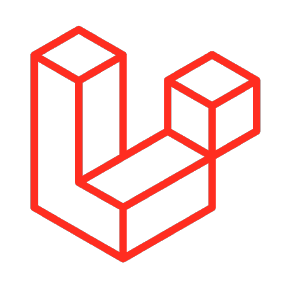

## About Me
- 🇲🇾 Live in Malaysia.
- 🏢 Currently working at [@JeekieHost](https://github.com/jeekiehost).
- 🌱 Currently learning Javascript, Typescript, Node.js, Golang, PHP, Laravel, and React.

## Languages and Tools
      
